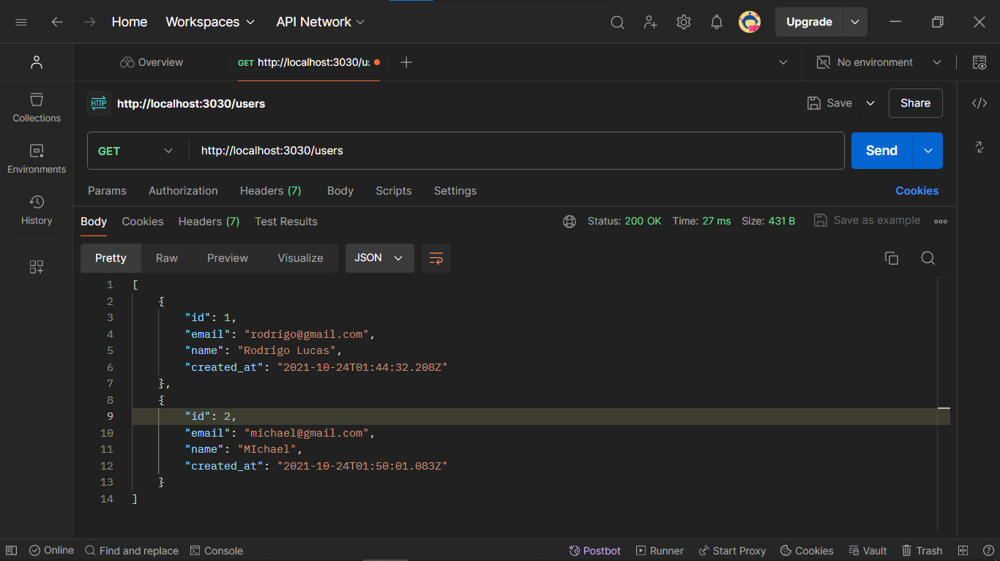
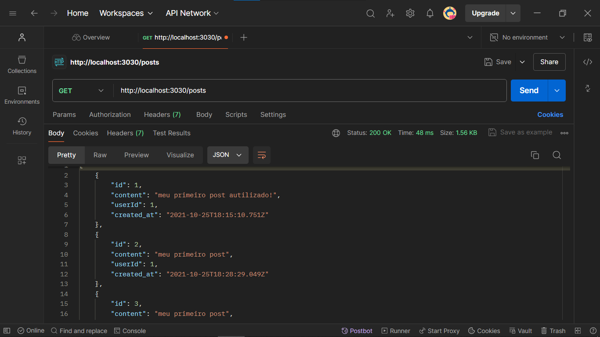
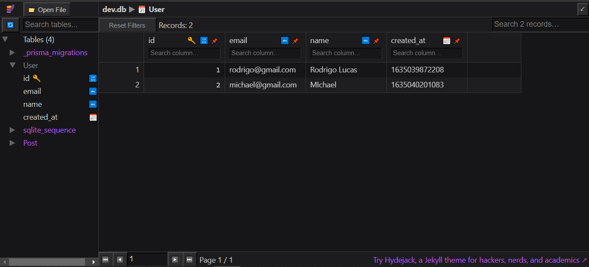
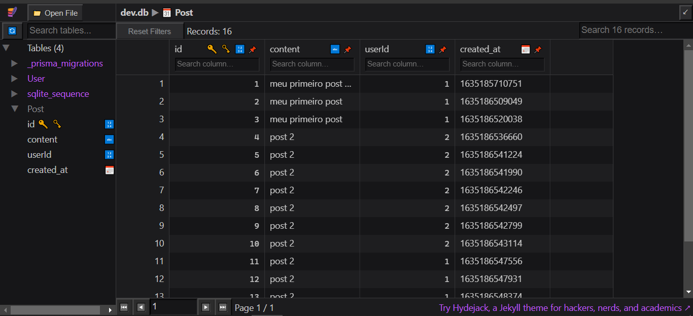

# API COM PRISMA
👨‍🏫API RESTFUL COM PRISMA E SQLITE.

 <br> 
 <br> 
 <br> 
 <br> 

## DESCRIÇÃO:
Esse projeto é uma API RESTful para gerenciar dois recursos principais: **Usuários** e **Posts**. Ele usa o Prisma como ORM (Object-Relational Mapping) para interagir com o banco de dados `SQLITE`.

## FUNCIONALIDADES:
1. **Gerenciamento de Usuários**:
  - **Criar Usuário**: Permite adicionar novos usuários.
  - **Listar Usuários**: Recupera todos os usuários do banco de dados.
  - **Buscar Usuário**: Recupera um usuário específico pelo ID.
  - **Atualizar Usuário**: Atualiza informações de um usuário existente.
  - **Deletar Usuário**: Remove um usuário do banco de dados.

2. **Gerenciamento de Posts**:
  - **Criar Post**: Permite criar um novo post associado a um usuário.
  - **Listar Posts**: Recupera todos os posts do banco de dados.
  - **Atualizar Post**: Atualiza o conteúdo de um post existente.

## EXECUTANDO O PROJETO:
1. **Instalando as Dependências:**
  - Para instalar as dependências listadas no arquivo "package.json", você pode usar o comando `npm install` no terminal. Certifique-se de estar no diretório `CODIGO` e execute o seguinte comando:
  ```bash
  npm install
  ```

2. **Inicie o Servidor:**
  - Execute o seguinte comando no Terminal:
  ```bash
  npm run dev
  ```

3. **Testar os Endpoints da API**:
  - **Criar Usuário**: `POST /user`
    - Corpo: `{ "name": "Nome", "email": "email@example.com" }`

  - **Listar Usuários**: `GET /users`

  - **Buscar Usuário**: `GET /user/:id`
    - Parâmetro: `id` do usuário

  - **Atualizar Usuário**: `PUT /user/:id`
    - Corpo: `{ "name": "Novo Nome", "email": "novoemail@example.com" }`

  - **Deletar Usuário**: `DELETE /user/:id`
    - Parâmetro: `id` do usuário

  - **Criar Post**: `POST /post/user/:id`
    - Corpo: `{ "content": "Conteúdo do post" }`
    - Parâmetro: `id` do usuário ao qual o post está associado

  - **Listar Posts**: `GET /posts`

  - **Atualizar Post**: `PUT /post/:id`
    - Corpo: `{ "content": "Novo conteúdo do post" }`
    - Parâmetro: `id` do post

## EXEMPLOS DE REQUISIÇÕES:
### 1. GERENCIAMENTO DE USUÁRIOS:
#### CRIAR USUÁRIO:
- **Método**: `POST`
- **Endpoint**: `/user`
- **Descrição**: Cria um novo usuário.
- **Corpo da Requisição**:
  ```json
  {
    "name": "João da Silva",
    "email": "joao.silva@example.com"
  }
  ```
- **Resposta Esperada**:
  ```json
  {
    "id": 1,
    "name": "João da Silva",
    "email": "joao.silva@example.com"
  }
  ```

#### LISTAR TODOS OS USUÁRIOS:
- **Método**: `GET`
- **Endpoint**: `/users`
- **Descrição**: Recupera todos os usuários.
- **Resposta Esperada**:
  ```json
  [
    {
      "id": 1,
      "name": "João da Silva",
      "email": "joao.silva@example.com"
    },
    {
      "id": 2,
      "name": "Maria Oliveira",
      "email": "maria.oliveira@example.com"
    }
  ]
  ```

#### BUSCAR USUÁRIO POR ID:
- **Método**: `GET`
- **Endpoint**: `/user/:id`
- **Descrição**: Recupera um usuário específico pelo ID.
- **Parâmetros**: `id` (número do usuário)
- **Resposta Esperada**:
  ```json
  {
    "id": 1,
    "name": "João da Silva",
    "email": "joao.silva@example.com"
  }
  ```
- **Resposta de Erro** (se o usuário não for encontrado):
  ```json
  {
    "error": "Não é possível encontrar esse usuário"
  }
  ```

#### ATUALIZAR USUÁRIO:
- **Método**: `PUT`
- **Endpoint**: `/user/:id`
- **Descrição**: Atualiza as informações de um usuário existente.
- **Corpo da Requisição**:
  ```json
  {
    "name": "João da Silva Atualizado",
    "email": "joao.silva.atualizado@example.com"
  }
  ```
- **Parâmetros**: `id` (número do usuário)
- **Resposta Esperada**:
  ```json
  {
    "id": 1,
    "name": "João da Silva Atualizado",
    "email": "joao.silva.atualizado@example.com"
  }
  ```

#### DELETAR USUÁRIO:
- **Método**: `DELETE`
- **Endpoint**: `/user/:id`
- **Descrição**: Remove um usuário do banco de dados.
- **Parâmetros**: `id` (número do usuário)
- **Resposta Esperada**:
  ```json
  {
    "message": "Usuário deletado"
  }
  ```
- **Resposta de Erro** (se o usuário não for encontrado):
  ```json
  {
    "error": "Não é possível encontrar esse usuário"
  }
  ```

### 2. GERENCIAMENTO DE POSTS:
#### CRIAR POST:
- **Método**: `POST`
- **Endpoint**: `/post/user/:id`
- **Descrição**: Cria um novo post associado a um usuário.
- **Corpo da Requisição**:
  ```json
  {
    "content": "Este é um novo post!"
  }
  ```
- **Parâmetros**: `id` (número do usuário ao qual o post está associado)
- **Resposta Esperada**:
  ```json
  {
    "id": 1,
    "content": "Este é um novo post!",
    "userId": 1,
    "author": {
      "id": 1,
      "name": "João da Silva",
      "email": "joao.silva@example.com"
    }
  }
  ```

#### LISTAR TODOS OS POSTS:
- **Método**: `GET`
- **Endpoint**: `/posts`
- **Descrição**: Recupera todos os posts.
- **Resposta Esperada**:
  ```json
  [
    {
      "id": 1,
      "content": "Este é um novo post!",
      "userId": 1,
      "author": {
        "id": 1,
        "name": "João da Silva",
        "email": "joao.silva@example.com"
      }
    }
  ]
  ```

#### ATUALIZAR POST:
- **Método**: `PUT`
- **Endpoint**: `/post/:id`
- **Descrição**: Atualiza o conteúdo de um post existente.
- **Corpo da Requisição**:
  ```json
  {
    "content": "Conteúdo do post atualizado!"
  }
  ```
- **Parâmetros**: `id` (número do post)
- **Resposta Esperada**:
  ```json
  {
    "message": "Post Atualizado!"
  }
  ```
- **Resposta de Erro** (se o post não for encontrado):
  ```json
  {
    "message": "Post inexistente"
  }
  ```

### EXEMPLOS COM `CURL`:
#### CRIAR USUÁRIO:
```bash
curl -X POST http://localhost:3030/user \
     -H "Content-Type: application/json" \
     -d '{"name": "João da Silva", "email": "joao.silva@example.com"}'
```

#### LISTAR TODOS OS USUÁRIOS:
```bash
curl -X GET http://localhost:3030/users
```

#### BUSCAR USUÁRIO POR ID:
```bash
curl -X GET http://localhost:3030/user/1
```

#### ATUALIZAR USUÁRIO:
```bash
curl -X PUT http://localhost:3030/user/1 \
     -H "Content-Type: application/json" \
     -d '{"name": "João da Silva Atualizado", "email": "joao.silva.atualizado@example.com"}'
```

#### DELETAR USUÁRIO:
```bash
curl -X DELETE http://localhost:3030/user/1
```

#### CRIAR POST:
```bash
curl -X POST http://localhost:3030/post/user/1 \
     -H "Content-Type: application/json" \
     -d '{"content": "Este é um novo post!"}'
```

#### LISTAR TODOS OS POSTS:
```bash
curl -X GET http://localhost:3030/posts
```

#### ATUALIZAR POST:
```bash
curl -X PUT http://localhost:3030/post/1 \
     -H "Content-Type: application/json" \
     -d '{"content": "Conteúdo do post atualizado!"}'
```

## NÃO SABE?
- Entendemos que para manipular arquivos em muitas linguagens e tecnologias relacionadas, é necessário possuir conhecimento nessas áreas. Para auxiliar nesse aprendizado, oferecemos cursos gratuitos disponíveis:
* [CURSO DE JAVASCRIPT](https://github.com/VILHALVA/CURSO-DE-JAVASCRIPT)
* [CURSO DE NODEJS](https://github.com/VILHALVA/CURSO-DE-NODEJS)
* [CURSO DE EXPRESSJS](https://github.com/VILHALVA/CURSO-DE-EXPRESSJS)
* [CURSO DE SQLITE](https://github.com/VILHALVA/CURSO-DE-SQLITE)
* [CURSO DE API REST](https://github.com/VILHALVA/CURSO-DE-API-REST)
* [CURSO DE PRISMA](https://github.com/VILHALVA/CURSO-DE-PRISMA)
* [CONFIRA MAIS CURSOS](https://github.com/VILHALVA?tab=repositories&q=+topic:CURSO)

## CREDITOS:
- [PROJETO CRIADO PELO "Rodrigo322"](https://github.com/Rodrigo322/api-prisma)
- [VEJA O VIDEO DESSE PROJETO](https://youtu.be/620br2rSkFQ?si=wJQhg6HqnSfpToGc)
- [PROJETO EDITADO PELO VILHALVA](https://github.com/VILHALVA)


